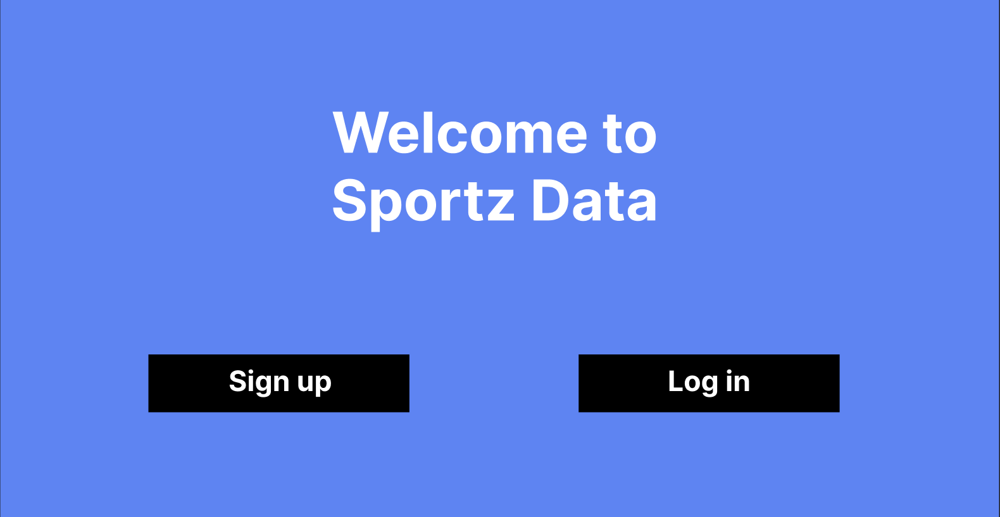

# Sportz-Data-api

## Overview
Overview - This app allows users to search for any team in the NFL, NBA, NHL, MLB, NCAAF, NCAAB and show different stats. Stats include, team conference/ division, real-time scores, and current betting odds. The app also allows users to favorite teams to easily keep track of them.

### Technologies used
Backend:
- Mongoose
- Axios
- Node/ Express
Frontend:
- React
- Bootstrap

## User Stories
- Users should be able to sign up
- Users should be able to log in  
- Users should be able to change password
- Users should be able to log out
- User should be able to search for a sports team in the leagues given
- Users should be able to save their favorite sports team to their library
- Users should be able to view all saved sports teams
- User should be able to click each sports tab and access that sports information
- User should be able to see the odds of the current game that is happening for each team (if supplied)

## Wireframes

## ERD

